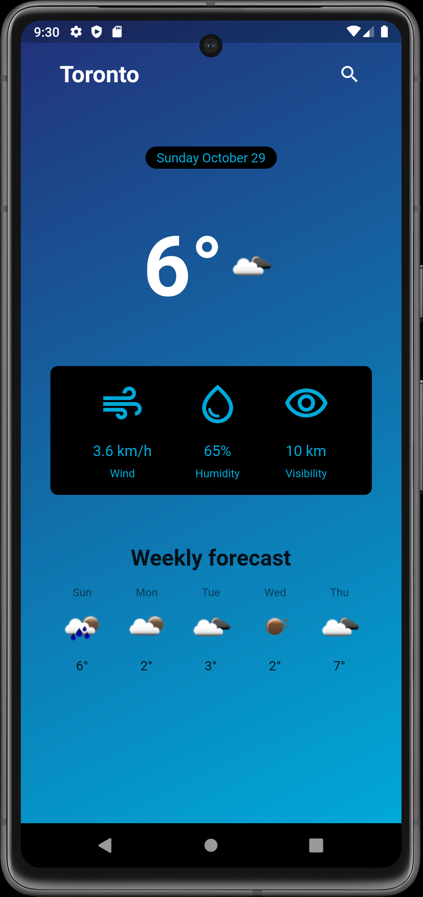
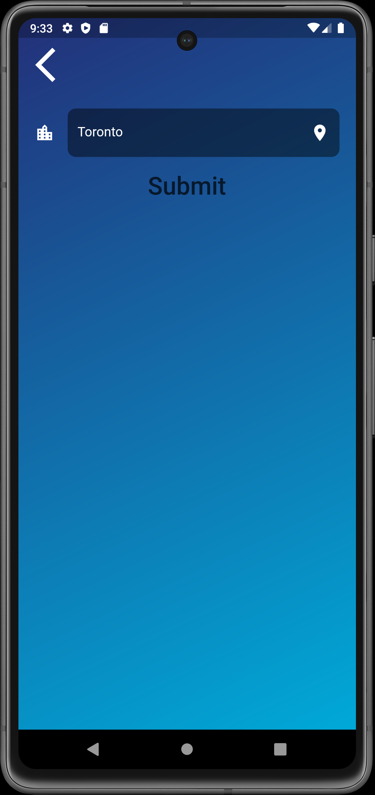

# Weather Leaf - Weather App

Weather Leaf is a user-friendly, efficient application for tracking real-time weather updates across various locations.
This application was developed using Flutter, and it employs the OpenWeatherMap API for fetching accurate weather data.

<table style="width: 100%;">
  <tr>
    <td style="width: 50%; text-align: center;">
      
    </td>
    <td style="width: 50%; text-align: center;">
      
    </td>
  </tr>
</table>

## Features

- Retrieve real-time weather updates by city name
- Fetch location-based weather data
- Loading and error screens for a seamless user experience

## Technologies Used

- Flutter
- Dart
- OpenWeatherMap API
- Riverpod for state management

## Project Structure

The project follows a feature-first architecture

## Setup and Installation

1. Clone this repository.
2. Navigate to the project directory.
3. Run `flutter pub get` to install the necessary dependencies.
4. Create a new file to store your api in `lib/src/api` named `api_keys.dart`.
5. Add your OpenWeatherMap API Key to the file like so: `const String apiKey = '<your-api-key>';`.
6. Run the app using `flutter run`.
